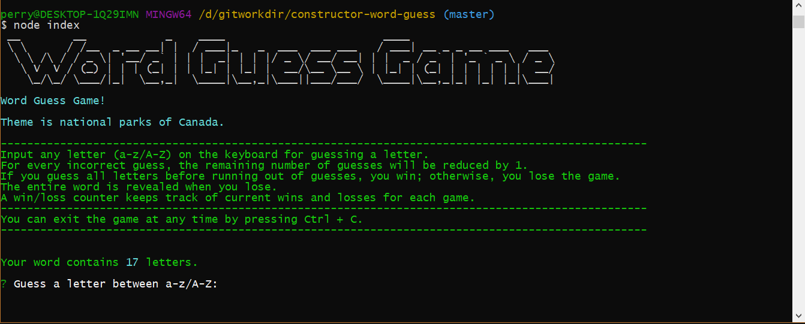
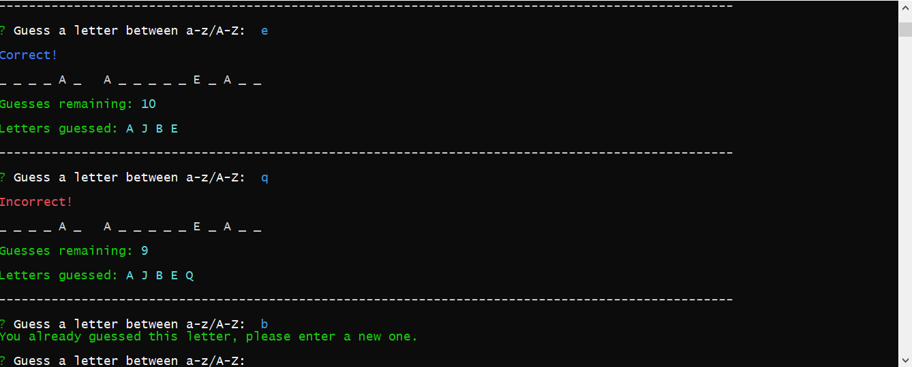
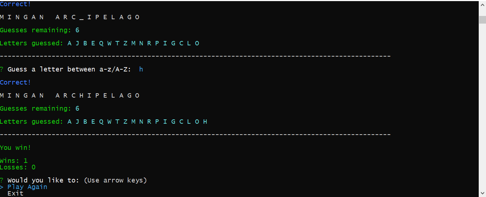

# Constructor Word Guess Game

* **Game Information**: This is a node.js based application with interactive prompts on the command-line. The theme is 27 national parks of Canada. Good luck and enjoy the game!

1. The game requires these npm packages installation: inquirer, is-letter, cli-color and figlet

* **Letter.js**: Contains a constructor, Letter. This constructor either displays an underlying character or a blank placeholder (such as an underscore), depending on whether or not the player has guessed the letter. 

* **Word.js**: Contains a constructor, Word that depends on the Letter constructor. This is used to create an object representing the current word the user is attempting to guess. 

* **index.js**: The file containing the logic for the course of the game, which depends on `Word.js` and:

  * Randomly selects a word and uses the `Word` constructor to store it

  * Prompts the user for each guess and keeps track of the user's remaining guesses

2. `Letter.js` *should not* `require` any other files.

3. `Word.js` *should only* require `Letter.js`

4. To play the game, run `node index` in GitBash for Windows or in Terminal for Mac.

* **Screenshot Images**

